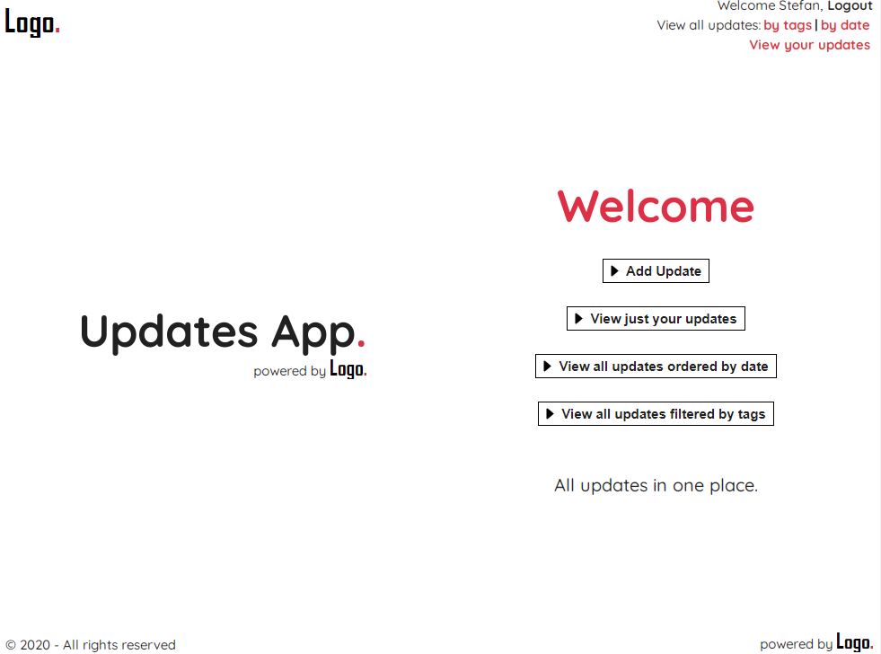
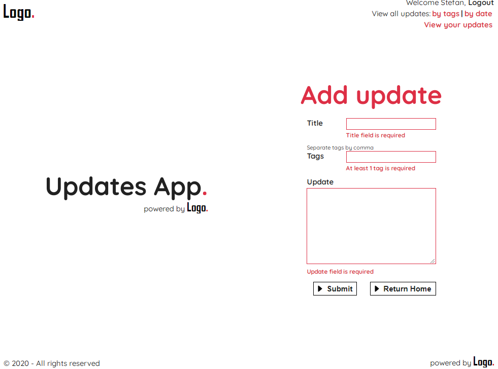
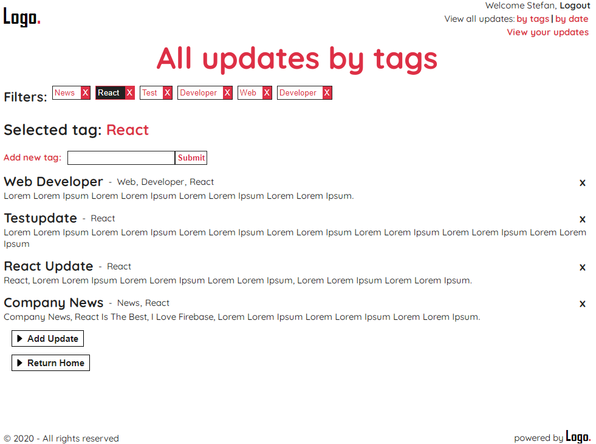

# Updates App - 2020

**A simple App where employees can login and add/remove company updates.**



## Description

Updates App built with React ^16.13.1 which includes user authentication and allows user to see all company updates with different filters.
All updates and tags are stored in Firebase.

**I used:**

- React JS
- React Router
- React Hooks and custom hooks
- Node Sass
- Firebase

### Setup Firebase

1. Create a new app.
2. Create a new Cloud Firestore database.
3. Create a local env file(.env.local) with following credentials:
   FIREBASE_API_KEY = xxxxxxxxxxxxxxxxxxxxxxxxxxxxxxx
   FIREBASE_AUTH_DOMAIN = xxxxxxxxxx.firebaseapp.com
4. Update databaseURL and projectID from firebase.js which can be found in src folder.

#### Installation Npm - npm install

```
`npm start` - Runs the app in the development mode.
`npm build` - Builds the app for production to the `build` folder.
`npm test` - Launches the test runner in the interactive watch mode.
```

#### Installation Yarn - yarn install

```
`yarn start` - Runs the app in the development mode.
`yarn build` - Builds the app for production to the `build` folder.
`yarn test` - Launches the test runner in the interactive watch mode.
```

**_Enjoy, Stefan 🚀🚀🚀_**

##### Other Images



